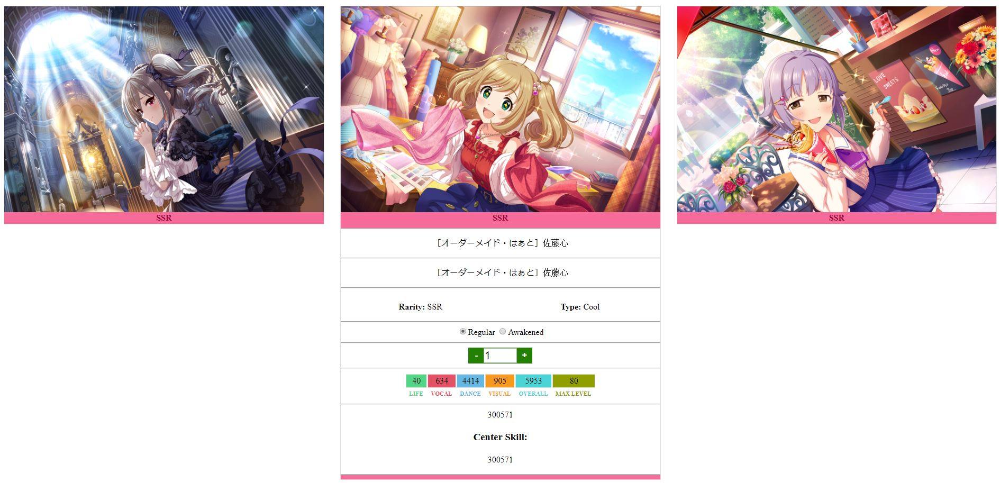

This project is just me testing out django and finding ways to reduce the usage of certain javascript libraries while still keeping all of the features I like. 

Cards can be clicked and expanded and card art can be changed with a change of a radio button. It's also responsive and the images will resize to fit the current browser window.

A few parts are left out of this repository since they involve grabbing a database and assets from an APK but here's an example of what the output currently looks like:

Some translation work still needs to be done and that'll involve grabbing data from the API at https://starlight.kirara.ca/

At some point I'll probably make this a proper README with how to set up the project but since it's likely going to be changed to work with a different game, I'm leaving that for later.